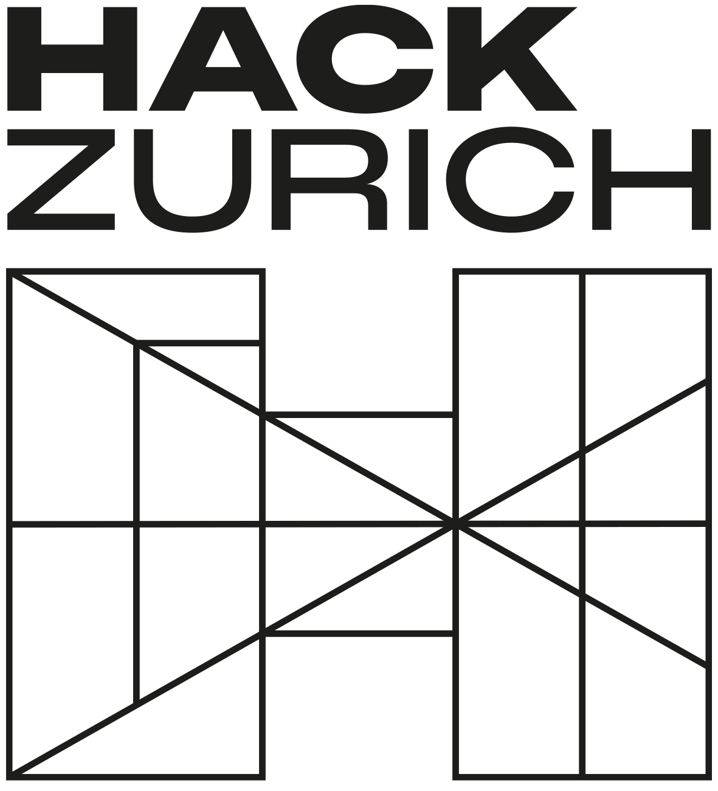

<p align="center">
  
</p>

# HackZurich 2023 - Scan the Bank Workshop
Welcome to the Scan the Bank Workshop. This README leads you through this challenge and contains all the relevant information. In case something is unclear, don't hesitate to get in touch with us.

## Motivation
With the General Data Protection Regulation (GDPR) of the EU coming into effect, banks face the challenge to ensure compliance. GDPR Compliance means an organization that falls within the scope of the GDPR meets the requirements for properly handling personal data as defined in the law. The GDPR outlines certain obligations organizations must follow which limit how personal data can be used. Under this falls also deleting personal information that is no longer needed to be saved. To fullfil the requirements, vast amount of data, that was created before the initialization of GDPR, must be checked whether they contain any personal data. Also in case that sensitive data is saved in wrong locations, we want a possibility to detect such data protection violations.

These tasks are not tractable soley by human labor and requires an automated solution. A possible approach is a file crawler that labels documents that clearly aren't complying, as well as flagging uncertain cases for further human review.

## Your Task
Your challenge is building a fast and accurate data crawler that classifies whether a file is containing sensitive content or not and in doubt labels the document for further review. The files are a mix of different media and file types for which you have to find out approaches to indentify their content. Below, you will find further details about the general structure of the challenge.

## Repo Structure
The general repo structure functions as boilerplate code to give you a jump-start but is also necessary to run your solution properly in the evaluation environment (more about this later). We recommend to fork the

The `app` directory contains the heart of your crawler. The `crawler.py` must contain your crawler. If you want to split up your code feel free to put more files in there but make sure that executing `crawler.py` is starting your algorithm. Put all packages that your solution needs in the `requirements.txt` file. [Here](https://pip.pypa.io/en/stable/reference/requirements-file-format/) you can find an explanation of the syntax of pip requirements files.

The `files` directory is where the files belong which the crawler has to label. We give you a few examples of files along with the corresponding labels so that you can examine their structure. You can download a ZIP file of them [here](https://drive.google.com/file/d/1KDqF4_NIhvvxdjyBgxTomzunPPWQxMDB/view?usp=sharing) and unzip them in your `files` folder. The labels can be found among the files in `labels.csv`. Don't worry about the naming of the other files, the names are randomized.

## Definition of Sensitive Data

## Tips
### Analyze The Sample Data
Before you start building your awesome crawler, analyze the sample data properly and ask yourself fundamental questions about the problem structure. What file types exist? How does the file content look like when you open them? Which file types should you prioritize?

### Handy Tools & Concepts
There are many tools out there that can do a lot of the heavy lifting for you. Already the built-in regex library of Python goes a long way. Take also a look at tools like [nltk](https://www.nltk.org/) that can do things like [Named Entity Recognition (NER)](https://medium.com/mysuperai/what-is-named-entity-recognition-ner-and-how-can-i-use-it-2b68cf6f545d). You can also try out using [pretrained Machine Learning models](https://huggingface.co/learn/nlp-course/chapter4/2?fw=pt), but be careful to stay withing the Docker image size limits (see "Hand-In").

### Reuse & Chain Code
Sometimes you can restructure a specific file type so that you can use a calssifier that you built for another task. Try to modularize your code and reuse features that you already implemented. So you can build pipelines for different data types without having to reinvent the wheel. Per example for audio files you could build a speech-to-text module that feeds its output in your already existing text classifier. But beware, errors tend to compound when chaining estimators. So choose wisely whether you give something a `false` instead of a `review` as a label.

### Check If Your Solution Runs Correctly
We check your solutions within a Docker image to ensure that your solution will also run on our hardware. We advise you to check your solution within Docker as well. [Install Docker](https://docs.docker.com/engine/install/) on your machine then go to the root directory of your local copy of this repo and run the command
```
docker build -t crawler .
```
This creates a Docker image from your `Dockerfile`. Afterwards, you can run the container by entering following command in your terminal
```
docker run --network none crawler
```

## Hand-In
We run the evaluation without internet connection so that no web APIs can be used for the solution. If you need a ML model or other downloadable content make sure to modify your `Dockerfile` so that it is downloaded when the image gets built. Also make sure that your Docker image is not bigger than 5GB.

To hand in your solution, fork this repo and commit your solution to your fork. We will run all solutions with the evaluation dataset and afterwards we will announce the scores of the individual teams.

## Rating System
The rating consists of two parts: the performance, i.e. how well the crawler classifies the files, and efficiency, i.e. how quick the crawler works through the files. 

80% of the total score are determined by the performance. Below we show the points which will be given for each possible configuration of classification and label. 

| Classification | Label  | Score |
| ---            | ---    | ---   |
| true           | true   | 20    |
| true           | false  | -20   |
| true           | review | -10   |
| false          | false  | 2     |
| false          | true   | -2    |
| false          | review | -1    |

The other 20% of the total score are determined by the efficiency of the solution. We will run all solutions on the same hardware and measure the time it takes for labeling all the data. The fastest solution will receive the maximum amount of points while the slowest solution will receive no points at all. The others will be graded in a linear fashion.

Both parts of the score will be normalized and summed up to reveal the overall winner of the challenge.
## How to Reach Us

